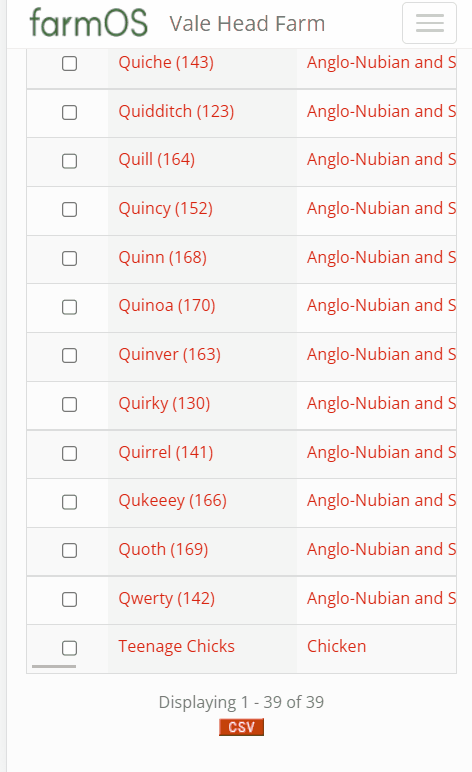

# farm_sendLIS
 FarmOS module to create a .csv file for submission to ARAMS/LIS 
 

You can select the animals from the animal list, and press Send in the action menu at the bottom.
From here, you select the destination type, the name of the destination, and the CPH number of the destination.
You can also choose whether you want to Archive the animals at the same time.
From here, it will generate a .csv file of the tag numbers, for submission to ARAMS or LIS, or for printing to attatch to the movement form.

(If printing, I recommend a thermal bluetooth printer, you can do it all from your phone then, and just staple it to the movement)
